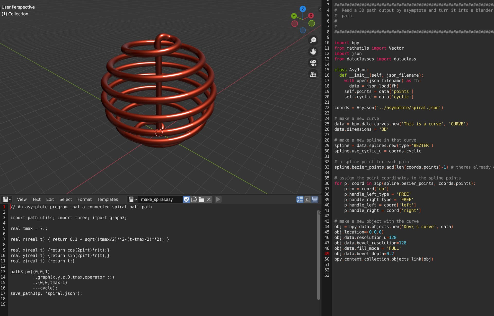

# Intro

This is a a proof of concept connecting the output from the program Asymptote (https://asymptote.sourceforge.io/ 2) and prepares it in a form for Blender. (I was surprised that nobody seems to have done this in the past!) Asymptote is an a command line program with mathematical roots originating in the TeX typesetting program from the middle of the 80’s. It has some unique capabilities with regards to solving global constraints for smooth connection of paths.

# Screenshot

# Contents

- file:path_utils.asy - A library for exporting a path to json suitable for blender
- file:spiral_ball.asy - An example creating the spiral ball in the screenshot above
- file:load_spiral.py - A blender script for reading the asymptote json output
- file:spiral.json - The asymptote output
